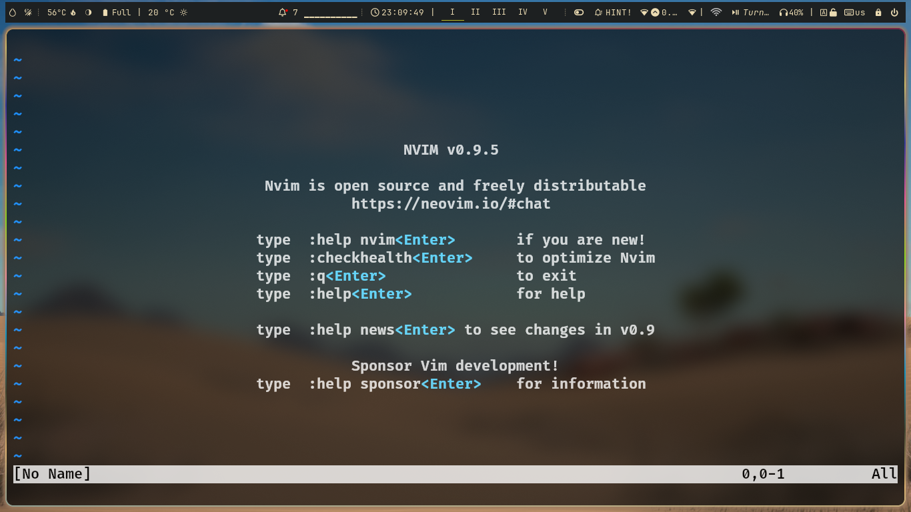

# neoVim-nvChad

#### Introduction
Hello guys this my config(I collected it from peoples).
in this md file i will tell you how to achiece a simple yet extraordinary ide like features in your neovim 
## 
If you don't know what is neovim i will tell you that.
#### What is vim ??
Vim is a text editor for Unix that comes with Linux, and macOS. It is known to be fast and powerful, partly because it is a small program that can run in a terminal .
So if you run nvim in your preffered termianl i use zsh but you are using linux which is a fresh installation you will be using bash.
##
#### This is what Terminal Looks like when you run nvim command in your pc

